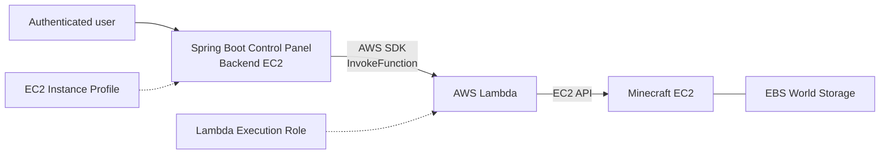

# AWS Minecraft Server Control Panel

An AWS-based control system for running a Minecraft server only when it is needed.

Minecraft runs on a dedicated EC2 instance that can be stopped while nobody is playing. A separate web panel remains available and allows an authenticated user to check the server state, start the instance, or stop it without accessing the AWS Console.

The project focuses on EC2 lifecycle management, serverless infrastructure operations, IAM least privilege, persistent storage, and secure communication between AWS services.

## Architecture



The system is divided into two parts:

- The **control plane** manages the lifecycle of the Minecraft infrastructure.
- The **game server** runs Minecraft and stores its persistent world data.

The control panel and Minecraft server use separate EC2 instances. This allows the Minecraft instance to be stopped while the management panel remains accessible.

## AWS services

### Amazon EC2

Two EC2 instances have different responsibilities.

#### Control panel instance

The control panel instance runs:

- Spring Boot
- Nginx
- `systemd`
- AWS SDK for Java

This instance remains online and provides the management interface.

It does not store AWS access keys. An EC2 Instance Profile supplies temporary AWS credentials automatically.

#### Minecraft instance

The second EC2 instance runs the Minecraft Java server.

When the instance starts, a `systemd` service automatically launches Minecraft. When it is not needed, the entire instance can be stopped to prevent further compute billing for that instance.

The Minecraft process is therefore connected to the EC2 lifecycle:

```text
EC2 stopped
    ↓
StartInstances
    ↓
EC2 pending
    ↓
EC2 running
    ↓
systemd starts Minecraft
```

The current panel monitors the EC2 state rather than the Minecraft process. A running EC2 instance may still need additional time before Minecraft is ready to accept players.

### AWS Lambda

Lambda acts as a restricted infrastructure controller between the web application and EC2.

Supported operations are:

- Retrieve the Minecraft instance state
- Start the Minecraft instance
- Stop the Minecraft instance

The backend sends an action to Lambda using AWS SDK. Lambda validates the action, checks the current EC2 state, and performs the appropriate transition.

The operations are idempotent:

- Starting an already running instance does not create an error.
- Stopping an already stopped instance does not create an error.
- Invalid state transitions are rejected.

Lambda was used instead of granting direct EC2 permissions to the web application. This creates a clear permission boundary and keeps EC2 lifecycle logic separate from the panel.

The trade-off is an additional AWS component and network call.

### AWS IAM

The project uses two separate IAM roles.

#### Control panel EC2 Instance Profile

The control panel role can invoke only the Minecraft controller Lambda function:

```text
lambda:InvokeFunction
```

It does not require permission to start, stop, or inspect EC2 instances directly.

#### Lambda execution role

The Lambda role contains the EC2 permissions:

```text
ec2:DescribeInstances
ec2:StartInstances
ec2:StopInstances
```

Start and stop permissions are restricted to the Minecraft instance ARN. `DescribeInstances` uses `Resource: "*"` because this EC2 read operation does not support the same resource-level restriction.

This separation creates the following trust chain:

```text
Control Panel EC2
    ↓ Instance Profile
Invoke Lambda
    ↓ Lambda Execution Role
Control Minecraft EC2
```

No AWS access key or secret key is stored in source code, application configuration, frontend JavaScript, or the production server.

### Amazon EBS

Minecraft is a stateful workload. World data must remain available even when the EC2 instance is stopped.

An EBS volume stores:

- Minecraft worlds
- Player data
- Server configuration
- Whitelist and operator data
- Plugins and logs

Stopping an EC2 instance does not delete its EBS volume. The world remains available when the instance starts again.

EBS storage continues to generate cost while EC2 is stopped. EBS Snapshots can later be added for automated backups.

### Public networking

The system exposes two different types of traffic:

- HTTPS traffic for the management panel
- Minecraft protocol traffic for the game server

Nginx terminates HTTPS and proxies requests to the Spring Boot application over the loopback interface.

The Spring Boot port is not publicly accessible. The Minecraft Security Group exposes only the game port required by Minecraft.

Recommended Security Group design:

#### Control panel instance

- `443/TCP`: Public HTTPS
- `22/TCP`: Trusted administrator IP only
- Application port: Not publicly exposed

#### Minecraft instance

- Minecraft TCP port: Allowed for players
- `22/TCP`: Trusted administrator IP only
- Other inbound traffic: Denied

A stable public address can be provided through an Elastic IP or DNS record. Public IPv4 and Elastic IP resources may continue generating cost even while an instance is stopped.

### CloudWatch

Lambda automatically writes execution logs to CloudWatch Logs when its execution role includes the basic logging permissions.

CloudWatch logs can be used to inspect:

- Received actions
- EC2 state transitions
- AWS SDK failures
- Missing permissions
- Invalid instance configuration
- Lambda execution errors

The Spring Boot application uses the `systemd` journal for application logs.

## Request flow

### Status check

```text
Browser
  → Control panel
  → Lambda Invoke
  → DescribeInstances
  → EC2 state
  → Panel state
```

State mapping:

| EC2 state       | Panel state |
| --------------- | ----------- |
| `running`       | `RUNNING`   |
| `stopped`       | `STOPPED`   |
| `pending`       | `STARTING`  |
| `stopping`      | `STOPPING`  |
| `shutting-down` | `STOPPING`  |
| Other           | `UNKNOWN`   |

### Start operation

```text
User request
  → Spring Boot
  → Lambda
  → DescribeInstances
  → StartInstances
  → EC2 pending
  → EC2 running
  → systemd starts Minecraft
```

### Stop operation

```text
User request
  → Spring Boot
  → Lambda
  → DescribeInstances
  → StopInstances
  → EC2 stopping
  → EC2 stopped
```

The current stop operation uses the EC2 API. A future version can use AWS Systems Manager Run Command to save the world and stop Minecraft gracefully before stopping EC2.

## Technology stack

| Area               | Technology                           |
| ------------------ | ------------------------------------ |
| Compute            | Amazon EC2                           |
| Serverless control | AWS Lambda                           |
| Authorization      | AWS IAM and EC2 Instance Profile     |
| Persistent storage | Amazon EBS                           |
| Logging            | CloudWatch Logs and `journalctl`     |
| Backend            | Java 21 and Spring Boot              |
| AWS integration    | AWS SDK for Java v2                  |
| Lambda runtime     | Python and Boto3                     |
| Reverse proxy      | Nginx                                |
| Process management | systemd                              |
| Testing            | JUnit, Mockito and Python `unittest` |

Spring Boot is intentionally used as a small management interface. The main engineering focus of the project is AWS resource orchestration and security.

## Configuration

### Control panel

| Variable               | Purpose                               |
| ---------------------- | ------------------------------------- |
| `AWS_REGION`           | Region containing the Lambda function |
| `LAMBDA_FUNCTION_NAME` | Controller Lambda function name       |
| `MINECRAFT_ADDRESS`    | Address displayed to users            |
| `APP_USERNAME`         | Panel login username                  |
| `APP_PASSWORD`         | Panel login password                  |

### Lambda

| Variable            | Purpose                                     |
| ------------------- | ------------------------------------------- |
| `INSTANCE_ID`       | Minecraft EC2 instance controlled by Lambda |

Production values and AWS credentials must not be committed to Git.

## Build and test

Run the Spring Boot tests:

```bash
./mvnw clean test
```

Run the Lambda tests:

```bash
python3 -m unittest discover lambda/minecraft-instance-controller/tests
```

Build the executable application:

```bash
./mvnw clean package
```

## Security decisions

- AWS credentials are provided through IAM roles.
- The backend cannot control EC2 directly.
- Lambda can manage only the configured Minecraft instance.
- Lambda has no public HTTP endpoint.
- API Gateway is not required.
- State-changing panel operations require authentication and CSRF protection.
- HTTPS terminates at Nginx.
- The backend application binds to the loopback interface.
- SSH should be restricted to trusted IP addresses.
- The Minecraft whitelist should be enabled.

## Cost behavior

When the Minecraft EC2 instance is stopped:

- Minecraft EC2 compute billing stops.
- EBS billing continues.
- Public IPv4 or Elastic IP billing may continue.
- The control panel EC2 remains running.
- Stored CloudWatch logs may continue generating cost.
- Lambda is charged only when invoked, subject to AWS pricing and Free Tier conditions.

The architecture reduces unused Minecraft compute time but does not eliminate all infrastructure costs.

## License

No license has been specified yet.
